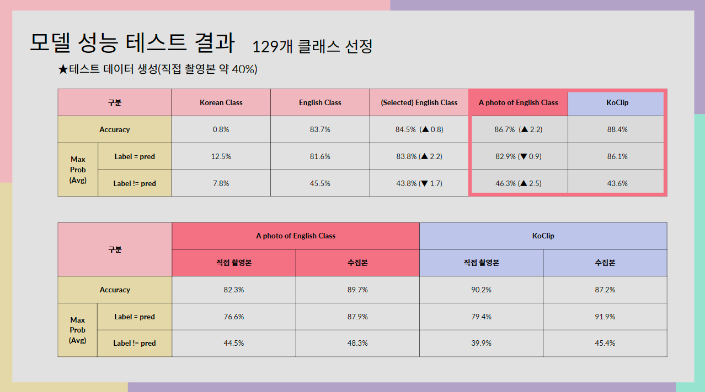
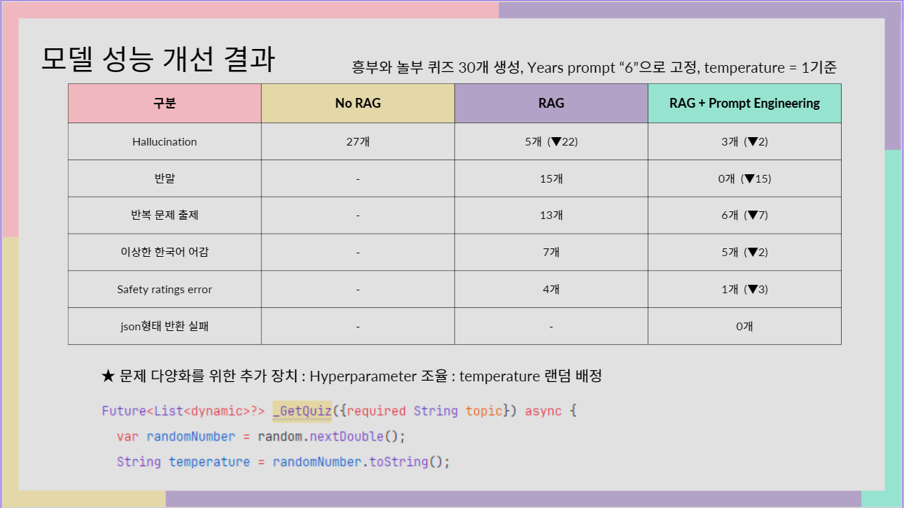
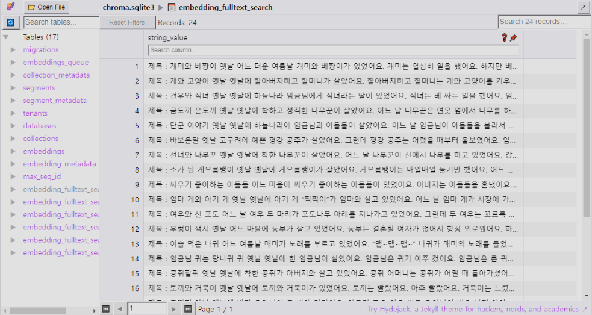

1. 동영상 - 현종님이 편집한거 그대로 넣으면 되고
2. 정의 - 앱배경 + 컨셉 머시기 머시기 깽이 - 영현님 PPT에 있는거 정리해서 넣으면되고
3. 앱 디자인


5. 모델 ( 기술스택 등 ) Flutter Server Model 조직도 등등 - 민기님이 정리한내용 좀 스크립트를 넣으면되고 + 프론트엔드 이야기 정도?
## It's AI Model Code and Result

#### Clip Model Result : 129 Class, Accuracy 86.7%


#### RAG + Gemini Result


##### ★ Vector DB 구조


##### ★ Prompt Engineering
```python
template = """Make three quizs for {years} years old kids and return list like '[json, json, json]'.

Quiz format rule:
- one right answer.
- three options.
- Use careful terms that fit the Korean sentence and Use honorifics.
- Options sentence must be short for kid

Making quiz tips
- Based on below context.
- Don't care about the time order of the context.
- Use the peripheral part and the whole context together.
- Don't use NEGLIGIBLE word.

json format: 
"question" : "quiz",
"options" : ["option1","option2","option3"],
"answer" : 0

context:
{context}

{again}
"""
```

5. 셋팅에 필요한 요소 - 무슨 API를 썼고 무슨 값을 넣어야하는지 대충 (코드에있는 내용 대충 써주기)
