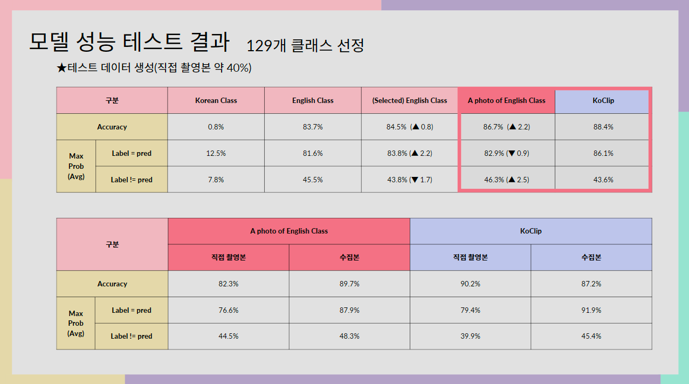
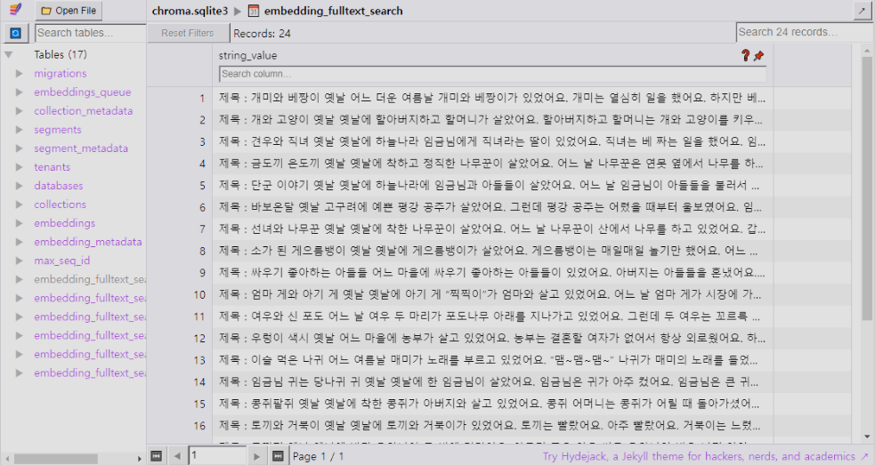

## It's AI Model Code and Result

#### Clip Model Result : 129 Class, Accuracy 86.7%


#### RAG + Gemini Result


##### ★ Vector DB 구조


##### ★ Prompt Engineering
```python
template = """Make three quizs for {years} years old kids and return list like '[json, json, json]'.

Quiz format rule:
- one right answer.
- three options.
- Use careful terms that fit the Korean sentence and Use honorifics.
- Options sentence must be short for kid

Making quiz tips
- Based on below context.
- Don't care about the time order of the context.
- Use the peripheral part and the whole context together.
- Don't use NEGLIGIBLE word.

json format: 
"question" : "quiz",
"options" : ["option1","option2","option3"],
"answer" : 0

context:
{context}

{again}
"""
```
